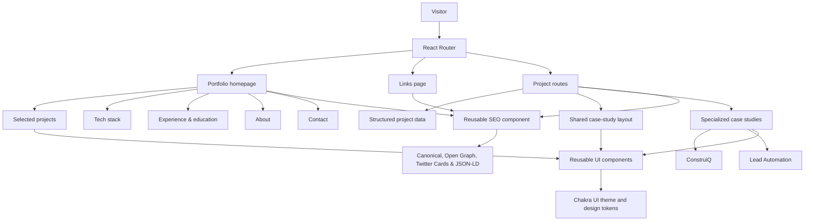

# Jean Borges Developer Portfolio

Personal developer portfolio built with React and TypeScript to present my work as a Full Stack Developer, selected projects, technical case studies, experience, and current technology stack.

The site is structured for recruiters and engineering teams who want to quickly understand what I build, which technologies I use, and how I approach product and engineering problems.

**Live site:** [jeanborgesdev.com](https://jeanborgesdev.com)


## Purpose

This portfolio was built to make my technical work easy to evaluate.

Instead of acting only as a project gallery, it brings together:

- selected development projects
- detailed technical case studies
- frontend, backend, database, testing, and cloud experience
- professional experience and education
- project screenshots and interactive image previews
- links to public source code when available
- links to live projects and production deployments
- SEO metadata and structured data

The current focus is Full Stack Junior and entry-level Software Engineer opportunities.

## Tech stack

### Frontend

- React
- TypeScript
- JavaScript
- Vite
- Chakra UI
- React Query

### Backend

- Node.js
- NestJS
- Express
- REST APIs

### Data

- PostgreSQL
- Prisma

### Testing and quality

- Jest
- Vitest
- Testing Library
- TypeScript
- ESLint

### Cloud and infrastructure

- AWS
- AWS CDK
- Docker
- Git
- GitHub

### Integrations

- Stripe
- External APIs

## Portfolio highlights

### ConstruiQ

**B2B full-stack marketplace for the construction industry**

ConstruiQ is the main technical case in the portfolio.

The project covers a complete marketplace workflow, including authentication, role-based access, job postings, applications, chat, contracts, payment flows, ratings, disputes, KYC, administrative features, and AWS infrastructure.

The portfolio includes a dedicated case study focused on the system's main flows, architecture, business rules, and engineering decisions.

[View the ConstruiQ case study](https://jeanborgesdev.com/projetos/construiq)

### Lead Automation App

**Full-stack lead scoring and sales pipeline application**

Application built with React, TypeScript, Node.js, Express, PostgreSQL, and Prisma.

The project includes lead registration, backend scoring rules, pipeline status management, dashboard metrics, persistent storage, and a public GitHub repository.

[View the case study](https://jeanborgesdev.com/projetos/lead-automation-app)  
[View source code](https://github.com/comscijb/lead-automation-app)

### Caldeirão da Bruxa

**Production website for a real business**

A complete responsive website developed for a real business, focused on user experience, commercial presentation, and production delivery.

[Visit the live website](https://caldeiraodabruxa.com)

### Clima Prime

**Responsive conversion-focused frontend case**

A fictional HVAC landing page built with React, TypeScript, Vite, and Chakra UI.

The project demonstrates responsive frontend development, reusable sections, information hierarchy, CTA design, and static deployment with Netlify.

[View the case study](https://jeanborgesdev.com/projetos/clima-prime)  
[View the live demo](https://clima-prime.netlify.app/)

## Main features

### Recruiter-focused homepage

The homepage is organized around the information most relevant to evaluating my profile:

- selected projects
- technical stack
- professional experience
- education
- English proficiency
- development approach
- contact and professional links

### Project case studies

Projects are modeled as structured data and exposed through dedicated routes.

The portfolio supports both reusable project pages and specialized case-study components for projects that require a deeper technical presentation.

Specialized cases currently include:

- ConstruiQ
- Lead Automation App

Other projects can use the shared case-study structure or link directly to an external production project.

### Project screenshots and lightbox

Technical cases include contextual screenshots so interfaces and workflows can be inspected alongside their explanations.

Images can be opened in an enlarged view without leaving the case study.

### SEO

The project includes reusable SEO infrastructure for:

- canonical URLs
- Open Graph metadata
- Twitter Card metadata
- JSON-LD structured data
- sitemap generation
- page-specific metadata

## Architecture



The application uses a shared routing and component system while keeping project content separated from presentation.

Projects with standard presentation needs use the reusable project structure, while technically deeper projects can use dedicated case-study components without changing the overall navigation model.

## Project structure

```text
.
├── public/
│   ├── projects/          # Project images and screenshots
│   ├── robots.txt
│   ├── sitemap.xml
│   └── og-image.png
├── scripts/
│   └── generate-sitemap.mjs
├── src/
│   ├── app/               # Application routing
│   ├── components/
│   │   ├── common/
│   │   ├── layout/
│   │   ├── project/
│   │   ├── sections/
│   │   ├── seo/
│   │   └── ui/
│   ├── config/            # Site and resume configuration
│   ├── data/              # Structured project content
│   ├── pages/
│   ├── theme/
│   └── types/
├── package.json
└── vite.config.ts
```

## Technical decisions

### Keep project content structured

Project metadata is stored separately from the main page layout.

This makes project information easier to maintain and allows the same data model to support project cards, routes, SEO, and case-study content.

### Support both reusable and specialized case studies

Not every project requires the same depth of presentation.

The portfolio uses a shared project system for standard cases while allowing projects such as ConstruiQ and Lead Automation to have dedicated components for more complex technical explanations.

### Organize the homepage around technical evaluation

The current homepage prioritizes projects, stack, experience, education, and contact information rather than a service-sales funnel.

This makes the site more appropriate as a developer portfolio and gives recruiters a faster path to the information needed to evaluate my profile.

### Centralize SEO behavior

Site metadata is managed through shared configuration and a reusable SEO component.

Individual pages can define their own title, description, canonical path, social image, robots behavior, and structured data without duplicating head-management logic.

### Keep deployment static

The portfolio is built as a Vite static application.

Production deployment only requires the generated `dist` output, while SPA routing is handled by the hosting configuration.

## Routes

| Route | Purpose |
| --- | --- |
| `/` | Main developer portfolio |
| `/links` | Direct links page |
| `/projetos/:slug` | Dynamic project case study |
| `*` | Not found page |

## Running locally

### Requirements

- Node.js
- npm

Clone the repository:

```bash
git clone https://github.com/comscijb/jean-borges-dev-portfolio.git
cd jean-borges-dev-portfolio
```

Install dependencies:

```bash
npm install
```

Start the development server:

```bash
npm run dev
```

## Validation and build

Run ESLint:

```bash
npm run lint
```

Create the production build:

```bash
npm run build
```

The production build runs sitemap generation, TypeScript compilation, and Vite bundling.

Preview the generated build locally:

```bash
npm run preview
```

## Testing

There is currently no automated test suite configured for this repository.

Current validation is based on:

- TypeScript compilation
- ESLint
- production build validation
- manual responsive checks
- manual navigation and interaction testing

Automated component or end-to-end tests are a future improvement.

## Deployment

The production portfolio is available at:

[https://jeanborgesdev.com](https://jeanborgesdev.com)

The application builds to a static `dist` directory.

Repository-specific hosting notes are documented in:

[`HOSTINGER_DEPLOY.md`](HOSTINGER_DEPLOY.md)

## Status

**Live and actively maintained.**

The current version is focused on presenting my profile for Full Stack Junior and entry-level Software Engineer opportunities, with selected projects, technical case studies, stack, experience, education, and direct professional contact information.

## Author

**Jean Borges**

Full Stack Developer focused on TypeScript, React, Node.js, and modern web applications.

- Portfolio: [jeanborgesdev.com](https://jeanborgesdev.com)
- GitHub: [github.com/comscijb](https://github.com/comscijb)
- LinkedIn: [Jean Guilherme Borges](https://www.linkedin.com/in/jean-guilherme-borges-b91823272)
