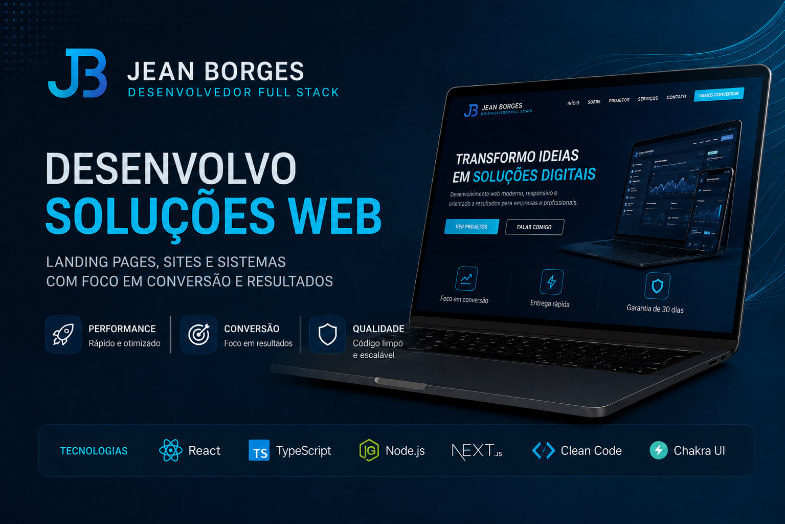
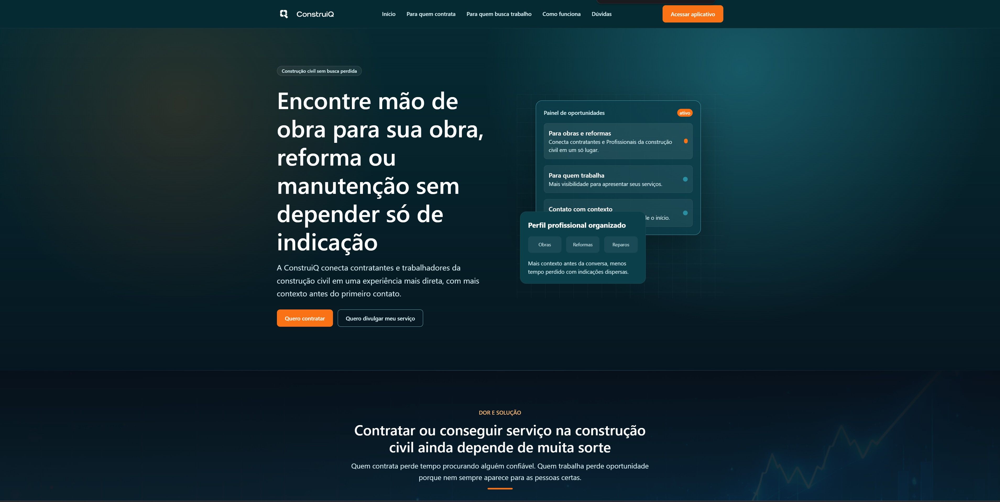
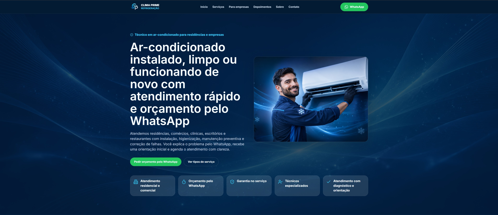
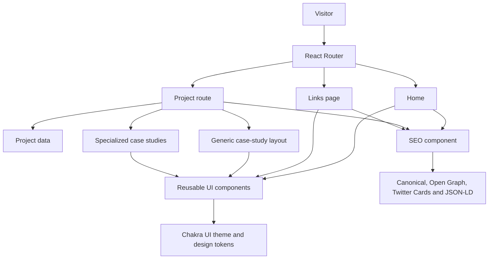

# Jean Borges Developer Portfolio

Personal developer portfolio built with React and TypeScript to present selected projects, technical case studies, and my work as a Full Stack Developer.

The site is designed as more than a project gallery. It gives each relevant project its own context, explaining the problem, the solution, the implementation, and the technical decisions behind the work.

**Live site:** [jeanborgesdev.com](https://jeanborgesdev.com)



## Purpose

A portfolio should make technical work easy to evaluate.

This project was built to give recruiters, engineering teams, founders, and potential clients a clear view of what I build, how I approach product problems, and which technologies I use.

The portfolio combines:

- a responsive personal landing page
- project discovery and navigation
- dedicated project case studies
- technical and business context
- SEO metadata and structured data
- responsive image galleries and project screenshots
- direct links to live work when available

## Tech stack

### Core

- React
- TypeScript
- Vite
- Chakra UI
- React Router

### UI and experience

- React Icons
- Responsive layouts
- Reusable design tokens
- Accessible navigation
- Project image lightboxes
- CSS-based animations

### SEO

- React Helmet Async
- Canonical URLs
- Open Graph metadata
- Twitter Card metadata
- JSON-LD structured data
- Sitemap generation

### Tooling

- ESLint
- TypeScript compiler
- npm

## Main features

### Project case studies

Projects are modeled as structured data and rendered through dedicated routes.

Each case can include:

- project context
- problem and solution
- role and responsibilities
- technologies
- relevant metrics
- key features
- screenshots
- external project links

The portfolio also supports specialized case-study experiences for projects that need a deeper technical presentation.

### ConstruiQ case study

ConstruiQ is the main technical case in the portfolio.

It presents a B2B marketplace for the construction industry and covers flows such as authentication, hiring, contracts, payments, reputation, disputes, administration, and infrastructure.



### Clima Prime case study

Clima Prime demonstrates a different type of work: a conversion-focused landing page for a local service business.

The case emphasizes responsive frontend development, page structure, user journey, commercial clarity, and deployment.



## Architecture



The application uses a shared router and reusable layout components, while project content is kept in structured data. This allows simpler projects to use the generic project page while more complex projects can have specialized case-study components without changing the overall navigation model.

## Project structure

```text
.
├── public/
│   ├── projects/          # Project images and screenshots
│   ├── robots.txt
│   ├── sitemap.xml
│   └── og-image.png
├── scripts/
│   └── generate-sitemap.mjs
├── src/
│   ├── app/               # Application routing
│   ├── components/
│   │   ├── common/
│   │   ├── layout/
│   │   ├── project/
│   │   ├── seo/
│   │   └── ui/
│   ├── config/            # Site-level configuration
│   ├── data/              # Project content
│   ├── pages/
│   ├── theme/
│   └── types/
├── package.json
└── vite.config.ts
```

## Technical decisions

### Keep project content structured

Project metadata and case-study content are stored separately from the main page layout.

This keeps project information easier to update and avoids duplicating page structure for every case.

### Allow specialized cases without replacing the generic route

Most projects can use a shared project presentation, while more complex cases can use their own component inside the same routing structure.

This keeps the project system flexible without forcing every case into the same format.

### Centralize SEO behavior

Site metadata is managed through a shared configuration and reusable SEO component.

Individual pages can define their own title, description, canonical path, social image, robots behavior, and structured data without duplicating head-management logic.

### Keep the deployment static

The portfolio is built as a Vite static application. Production deployment only requires the generated `dist` output, while SPA routing is handled by the hosting configuration.

This keeps the deployment model small and appropriate for a portfolio site.

## Routes

| Route | Purpose |
| --- | --- |
| `/` | Main portfolio |
| `/links` | Direct links page |
| `/projetos/:slug` | Dynamic project case study |
| `*` | Not found page |

## Running locally

### Requirements

- Node.js
- npm

Clone the repository:

```bash
git clone https://github.com/comscijb/jean-borges-dev-portfolio.git
cd jean-borges-dev-portfolio
```

Install dependencies:

```bash
npm install
```

Start the development server:

```bash
npm run dev
```

## Validation and build

Run ESLint:

```bash
npm run lint
```

Create the production build:

```bash
npm run build
```

The build process runs TypeScript compilation and Vite bundling. A sitemap generation script is also executed before the production build.

Preview the generated build locally:

```bash
npm run preview
```

## Testing

There is currently no automated test suite configured for this repository.

Current validation is based on:

- TypeScript compilation
- ESLint
- production build validation
- manual responsive checks
- manual navigation and interaction testing

Automated component or end-to-end tests are a future improvement rather than something currently implemented.

## Deployment

The production site is deployed at:

[https://jeanborgesdev.com](https://jeanborgesdev.com)

The application builds to a static `dist` directory.

Repository-specific hosting notes are documented in:

[`HOSTINGER_DEPLOY.md`](HOSTINGER_DEPLOY.md)

## Status

**Live and actively maintained.**

The portfolio already includes the main navigation, project system, responsive design, SEO infrastructure, and detailed case studies.

Current work is focused on improving project presentation and keeping the portfolio aligned with my most relevant development work.

## Author

**Jean Borges**

Full Stack Developer focused on TypeScript, React, Node.js, and modern web applications.

- Portfolio: [jeanborgesdev.com](https://jeanborgesdev.com)
- GitHub: [github.com/comscijb](https://github.com/comscijb)
- LinkedIn: [Jean Guilherme Borges](https://www.linkedin.com/in/jean-guilherme-borges-b91823272)
